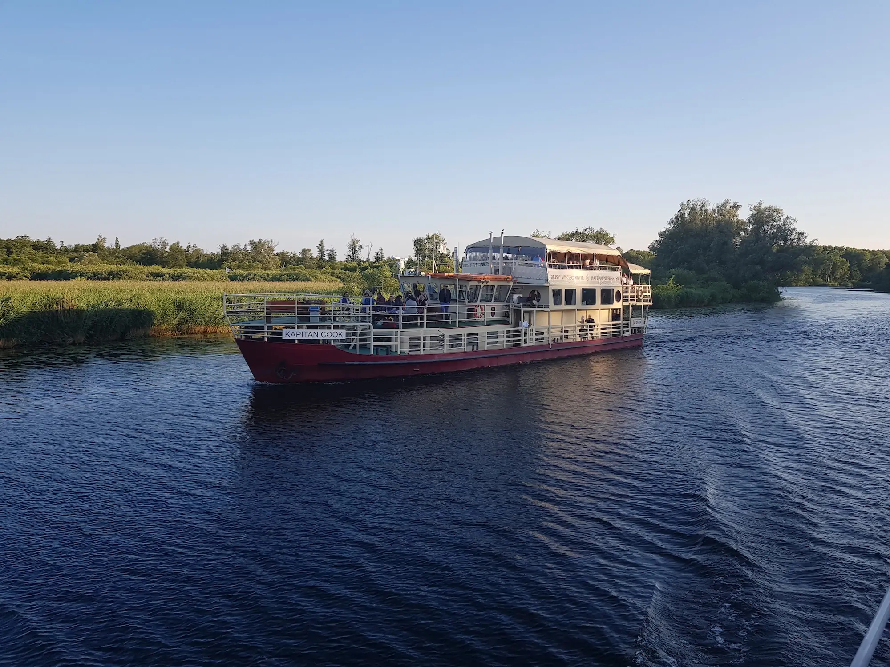
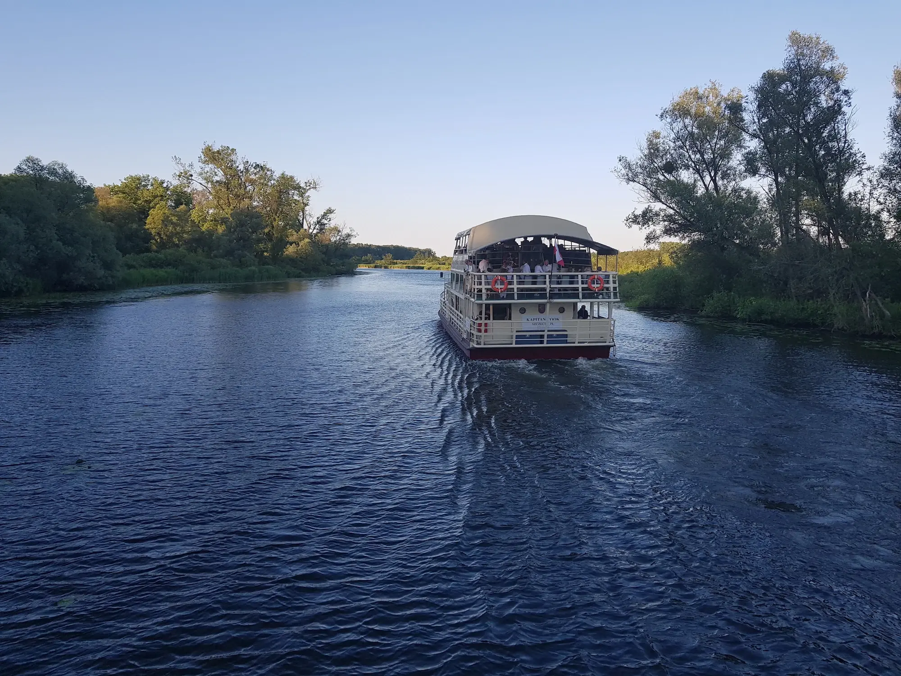
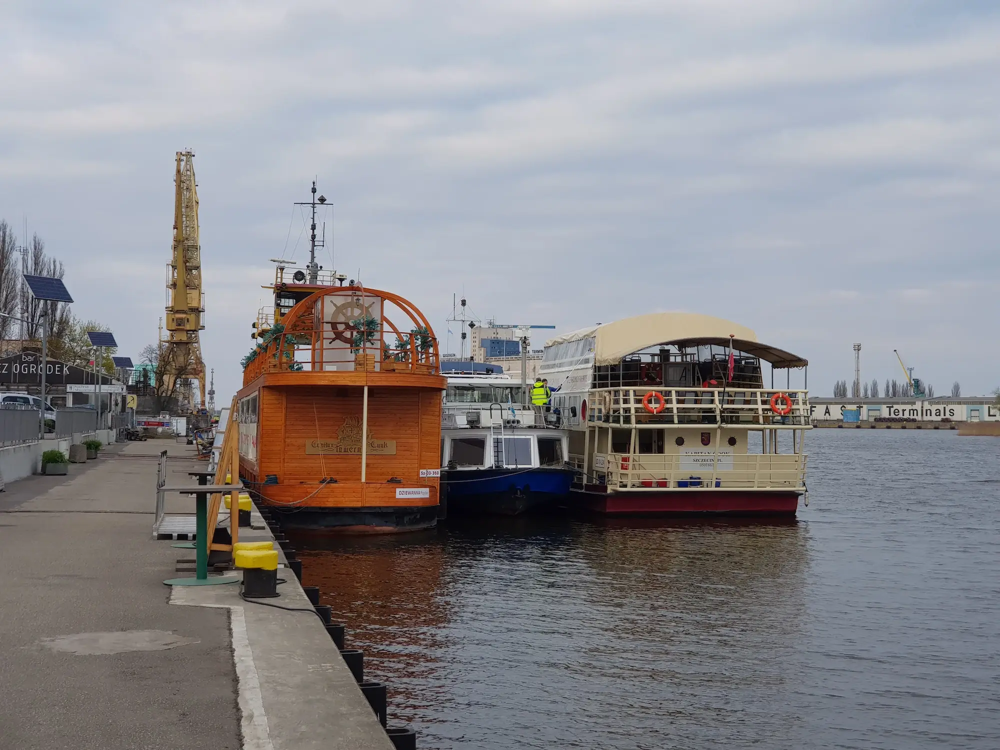

# Boat Tour

On Thursday 29th, we are delighted to offer an exclusive boat
cruise along the Odra River, Święta River, and Lake Dąbie. This is a unique
opportunity to explore parts of Szczecin that are typically inaccessible,
including the industrial architecture of the harbour- a significant piece of the
city's history, and the pristine natural beauty that has earned Szczecin the
nickname "Floating Garden."

Our [collaborator's](https://statek.pl/en) vessel, Captain Cook,
features two sun decks and a lounge with a bar serving a selection of beverages.
The cruise will begin at 18:30, ensuring we arrive at
Lake Dąbie just in time to see the sunset.
The location of the boat dock is Jana z Kolna 7.

Don't miss the chance to experience Szczecin from a fresh perspective and enjoy
a memorable evening on the water.

The number of tickets for this event is limited, get your ticket for this
exclusive cruise at the [registration
page](https://euroscipy.org/2024/tickets.html).

**See you on Thursday, August 29th at the boat dock at Jana z Kolna 7 at bit before 18:30.**
The boat dock looks like this:

