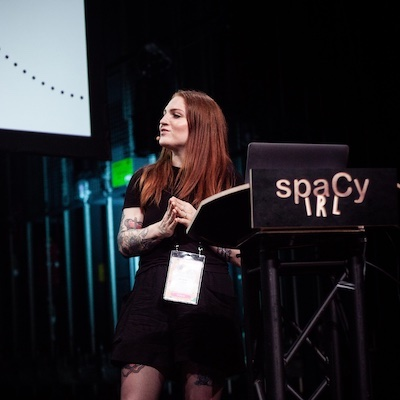

# Keynotes

We are pleased to announce the following keynotes at EuroSciPy this year.

## 10 Years of Open Source: Navigating the Next AI Revolution

   <i>Ines Montani - Explosion</i> 

### Abstract:

A lot has been happening in the field of AI and Natural Language Processing: 
there's endless excitement about new technologies, sobering post-hype hangovers 
and also uncertainty about where the field is heading next. In this talk, I'll 
share the most important lessons we've learned in 10 years of working on open 
source software, our core philosophies that helped us adapt to an ever-changing 
AI landscape and why open source and interoperability still wins over black-box,
proprietary APIs.

### Bio:

Ines Montani is a developer specializing in tools for AI and NLP technology. 
She’s the co-founder and CEO of Explosion and a core developer of spaCy, a 
popular open-source library for Natural Language Processing in Python, and 
Prodigy, a modern annotation tool for creating training data for machine 
learning models. Read more on [her website](https://ines.io/).

