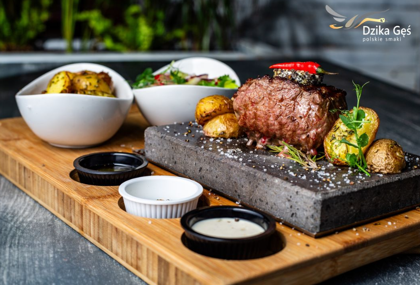

# Social Event

We are excited to invite you to this year's social dinner, which will be held on Wednesday, August 28th from 6:30 PM to 8:30 PM at [Dzika Gęś](https://dzikages.szczecin.pl/). This charming venue, located in the heart of Szczecin, offers a delightful terrace with views of the picturesque Orła Białego square and the 14th-century cathedral.

Dzika Gęś is renowned for its traditional Polish cuisine with a modern twist. The restaurant's menu includes a range of dishes, from zeppelins and dumplings to pork knuckles, shanks, roasted duck, goose, and both sea and freshwater fish from the lakes Ińsko and Miedwie.

For our special evening, the menu will feature:

- Atlantic cod with chanterelles, gnocchi, and sauerkraut
- Slow-roasted spare ribs served with potatoes and a red beetroot salad
- Stuffed cabbage rolls filled with buckwheat and mushrooms, accompanied by a rich mushroom sauce

Join us for an evening of delicious food, great company, and the warm ambiance of Polish hospitality.

We look forward to seeing you there!